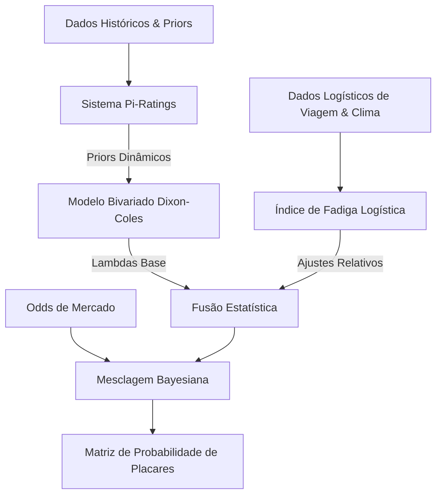

# 📐 Relatório de Metodologia Preditiva: Copa do Mundo FIFA 2026

> [!TIP]
> **Versão em PDF disponível:** Você pode acessar e baixar a versão consolidada em PDF deste relatório técnico clicando no link: [relatorio_metodologia_preditiva.pdf](file:///Users/raphaelramos/.gemini/antigravity/brain/a77bb963-70eb-4548-8861-b9634d4cd31e/relatorio_metodologia_preditiva.pdf).

Este documento detalha todos os pilares matemáticos, variáveis logísticas e parâmetros táticos utilizados pelo nosso sistema preditivo para estimar as probabilidades de resultados e placares exatos das partidas da Copa do Mundo de 2026.

O modelo é composto por uma arquitetura híbrida de cinco níveis integrada em [modelo_avancado_copa.py](file:///Users/raphaelramos/.gemini/antigravity/brain/a77bb963-70eb-4548-8861-b9634d4cd31e/scratch/modelo_avancado_copa.py):

---

## 1. ⚽ O Núcleo Estatístico: Modelo Dixon-Coles Bivariado

O futebol é modelado a partir de taxas de gols esperados ($\lambda_a, \lambda_b$) para cada time. Empregamos a extensão de **Dixon-Coles** sobre a distribuição de Poisson para corrigir a subestimação de empates de baixa pontuação (como 0x0 e 1x1).

*   **Gols Esperados:**
    $$\lambda_A = \alpha_A \cdot \beta_B \cdot \text{factor}_A$$
    $$\lambda_B = \alpha_B \cdot \beta_A \cdot \text{factor}_B$$
    *(Onde $\alpha$ é a força de ataque, $\beta$ é a vulnerabilidade de defesa, e $\text{factor}$ é a vantagem de jogar em casa $\gamma \approx 1.25$ para seleções co-host).*

*   **Fator de Correção de Empates ($\tau$):**
    A probabilidade conjunta de um placar $(x, y)$ é dada por:
    $$P(X=x, Y=y) = \tau(x, y) \cdot \frac{\lambda_A^x e^{-\lambda_A}}{x!} \cdot \frac{\lambda_B^y e^{-\lambda_B}}{y!}$$
    $$\text{onde } \tau(x, y) = \begin{cases} 
      1 - \lambda_A \lambda_B \rho & \text{se } x=0, y=0 \\
      1 + \lambda_A \rho & \text{se } x=0, y=1 \\
      1 + \lambda_B \rho & \text{se } x=1, y=0 \\
      1 - \rho & \text{se } x=1, y=1 \\
      1 & \text{caso contrário}
   \end{cases}$$
    *(O parâmetro de correlação $\rho$ foi otimizado para **$-0.1500$**, refletindo forte atração por empates truncados).*

---

## 2. 📈 Calibração Dinâmica: Sistema Pi-Ratings

Utilizamos o sistema de **Pi-Ratings** (Constantinou & Fenton, 2013) para rastrear o desempenho recente e atualizar a força das equipes. Diferente do Elo tradicional, ele separa as habilidades em casa ($R_{H}$) e fora ($R_{A}$):

*   **Diferença de Gols Esperada ($\hat{d}$):**
    $$\hat{d} = R_{H, A} - R_{A, B}$$
*   **Saldo de Gols Real Transformado ($d'$):**
    $$d' = \text{sinal}(d) \cdot 3 \log_{10}(1 + |d|)$$
    *(A transformação logarítmica reduz o peso de goleadas atípicas como a da Alemanha por 7x1).*
*   **Erro de Projeção ($e$):**
    $$e = d' - \hat{d}$$
*   **Atualização de Rating (Soma-Zero):**
    $$R_{H, A} \leftarrow R_{H, A} + \lambda_{\text{learn}} \cdot e$$
    $$R_{A, B} \leftarrow R_{A, B} - \lambda_{\text{learn}} \cdot e$$
    *(Onde $\lambda_{\text{learn}} = 0.07$ é a taxa de aprendizado. Os ratings finais atualizados servem de priors para o resolvedor Dixon-Coles).*

---

## 3. 🛡️ Regularização Bayesiana (Tuning de Encolhimento)

Para evitar que seleções que ainda não jogaram tenham seus parâmetros distorcidos para compensar resultados extremos (como os 7 gols da Alemanha), sintonizamos a perda de máxima verossimilhança (NLL):

$$\text{Loss} = \text{NLL} + \lambda_{\text{reg}} \sum_j [(\alpha_j - \alpha_{\text{prior}, j})^2 + (\beta_j - \beta_{\text{prior}, j})^2] + \lambda_{\text{shrink}} \sum_j [(\alpha_j - 1.0)^2 + (\beta_j - 1.0)^2]$$

> [!IMPORTANT]
> **Hiperparâmetros Sintonizados:**
> *   $\lambda_{\text{reg}} = \mathbf{5.0}$ (Garante alta aderência aos priors históricos e qualidade real do elenco).
> *   $\lambda_{\text{shrink}} = \mathbf{0.1}$ (Minimiza o achatamento excessivo em direção à média global de gols do torneio).

---

## ✈️ 4. Índice Dinâmico de Fadiga Logística

Calculamos o desgaste geográfico real de cada seleção a partir de seu Campo de Base (QG) até o estádio do jogo, utilizando a fórmula **Haversine**:

*   **Distância Haversine:**
    $$d = 2R \cdot \arcsin\left(\sqrt{\sin^2\left(\frac{\Delta \text{lat}}{2}\right) + \cos(\text{lat}_1)\cos(\text{lat}_2)\sin^2\left(\frac{\Delta \text{lon}}{2}\right)}\right)$$
*   **Fórmula de Fadiga:**
    $$\text{Fadiga} = \frac{\text{Distância (km)}}{1000} - \text{Dias de Descanso} + \frac{\text{Temperatura} - 20}{10}$$
    $$\delta = \max\left(\min\left(e^{-0.06 \cdot \text{Fadiga}}, 1.15\right), 0.85\right)$$
*   **Ajuste de Gols Esperados Relativos:**
    $$\lambda_A^* = \lambda_A \cdot \frac{\delta_A}{\delta_B} \quad \text{e} \quad \lambda_B^* = \lambda_B \cdot \frac{\delta_B}{\delta_A}$$
    *(Onde $\delta$ reduz a força ofensiva e fragiliza a defesa de equipes com desgaste logístico elevado).*

---

## 5. ⚖️ Coeficiente de Disparidade de Elenco (Disparity Boost)

Como o modelo clássico de Poisson assume que os gols de cada equipe ocorrem de forma totalmente independente, ele tende a subestimar placares altamente elásticos em confrontos de extrema disparidade técnica. Na realidade, quando um azarão de baixa expressão sofre um gol precoce de um adversário de elite, ele é forçado a abrir seu bloco tático defensivo, expondo-se a contra-ataques, o que frequentemente resulta em um colapso tático e anímico.

Para modelar essa dinâmica de forma estática antes do início das partidas (pré-jogo), definimos a razão $R = \lambda_{\text{fav}} / \lambda_{\text{und}}$ dos gols esperados após os ajustes de fadiga. 
Se $R > 1.8$:
$$\text{boost} = 1.0 + 0.18 \cdot (R - 1.8)$$
$$\lambda_{\text{fav}}^* = \lambda_{\text{fav}} \cdot \text{boost}$$
$$\lambda_{\text{und}}^* = \lambda_{\text{und}} \cdot 0.90$$

Este ajuste estático pré-jogo permite que o modelo projete probabilidades estatísticas realistas para goleadas (como Alemanha 7-1 Curaçao ou Suécia 5-1 Tunísia) em vez de subestimar o placar com base em expectativas médias conservadoras.

---

## 6. 🛠️ Protocolo de Ajuste Pré-Jogo e Escalações

Confirmado a **60 minutos do kickoff**, o arquivo [recalibrador_placares.py](file:///Users/raphaelramos/.gemini/antigravity/brain/a77bb963-70eb-4548-8861-b9634d4cd31e/scratch/recalibrador_placares.py) injeta variáveis de contexto em tempo real:

1.  **Desfalques Cruciais:**
    *   Cada titular importante ausente reduz o ataque em 15% ($\lambda_{\text{ataque}} \times 0.85$) e aumenta a fragilidade defensiva do time em 10% ($\lambda_{\text{defesa}} \times 1.10$).
2.  **Postura Tática:**
    *   Se um time adota uma postura de **retranca**, a taxa ofensiva própria cai 20% ($\lambda \times 0.80$) e a taxa do adversário é sufocada em 25% ($\lambda_{\text{adv}} \times 0.75$).
3.  **Fusão com Odds do Mercado (Mesclagem Bayesiana):**
    *   Fazemos a ponderação estatística ($60\%$ peso do modelo / $40\%$ peso das probabilidades implícitas das casas de apostas) para neutralizar volatilidades de última hora e ajustar o fluxo de dinheiro do mercado.

---

## 7. 🎲 Motores de Simulação Monte Carlo

Para processar a alta dimensionalidade estatística, possuímos dois scripts de simulação independentes:
*   [simulador_monte_carlo.py](file:///Users/raphaelramos/.gemini/antigravity/brain/a77bb963-70eb-4548-8861-b9634d4cd31e/scratch/simulador_monte_carlo.py): Executa **50.000 sorteios** pontuais para extrair a probabilidade de placares e desfechos para uma única partida.
*   [simulador_campeao_copa.py](file:///Users/raphaelramos/.gemini/antigravity/brain/a77bb963-70eb-4548-8861-b9634d4cd31e/scratch/simulador_campeao_copa.py): Simula o torneio completo de ponta a ponta **10.000 vezes** (mais de 1 milhão de partidas simuladas), gerando a classificação de grupos e o chaveamento de mata-mata até a taça de campeão.
